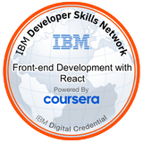

# 💫 About Me
* Hello World! I am an aspiring FinTech Data Analyst / Software Developer and I am currently seeking various educational programs to advance my skillset. 

* Qualifications encompass collaborating across teams to define needs, evaluate risks and issues, and implementing solutions. 

* Enjoys leveraging background and skill set to conduct thorough, effective analysis and solve complex problems.

 

## 🌐 Socials
 

 

## 💻 Tech Stack
 
    
    
    
     
    
    (https://shields.io)
     
     
     
     
     
    
     
     
     
     
     
     
     
     
     
     
    

 

## 📊 GitHub Stats:
 
 

 

## 🏆 Credly/Certification Badges:
 &nbsp;
 &nbsp;
 
 &nbsp;
 &nbsp;&nbsp;&nbsp;

 
 

## ✍️ Random Dev Quote

---

<!-- Proudly created with GPRM ( https://gprm.itsvg.in ) -->
