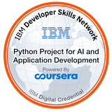

## 💫 About Me
<ul style="list-style-type:disc; font-family: Arial, sans-serif; font-size: 15px; line-height:2;">
  <li>Hello World! I am an aspiring Data Analyst / Software Developer and I am currently seeking various opportunities to advance my skillset and gain professional experience.</li>
  <li>Qualifications encompass collaborating across teams to define needs, evaluate risks and issues, and implementing solutions.</li>
  <li>Enjoys leveraging background and skill set to conduct thorough, effective analysis and solve complex problems.</li>
</ul>

 

## 🌐 Socials
 

 

## 💻 Tech Stack

     
     
    
     
    
    
    
    
     
     
    
     
    
     
     
    
     
     
     
     
     
     
    
     
     
    

 

## 📊 GitHub Stats:
 

 

<!--

-->

 

## 🏆 Credly/Certification Badges:
<!-- 
 &nbsp;
 &nbsp;
 &nbsp;
 &nbsp;
 &nbsp;
 &nbsp;
 &nbsp;
 &nbsp;&nbsp;&nbsp;
-->

&nbsp;

&nbsp;

&nbsp;

&nbsp;

&nbsp;

&nbsp;

&nbsp;

&nbsp;&nbsp;&nbsp;

 
 

## ✍️ Random Dev Quote

---

<!-- Proudly created with GPRM ( https://gprm.itsvg.in ) -->
